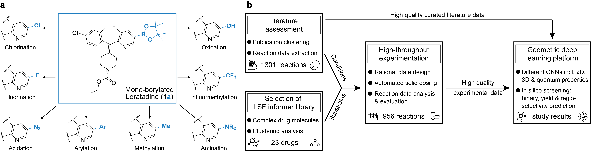

# Enabling late-stage drug diversification by high-throughput experimentation with geometric deep learning



This repository contains a reference implementation to preprocess the data, as well as to train and apply the graph machine learning models introduced in David F. Nippa, Kenneth Atz, et al. Journal, X, XX (2023).


## 1. Environment
Create and activate the lsfml environment. 

```
conda env create -f environment.yml
conda activate lsfml
poetry install
```

Add the "lsfml path" as PYTHONPATH to your `~/.bashrc` file. 

```
export PYTHONPATH="${PYTHONPATH}:<YOUR_PATH>lsfqml/"
```

Source your `~/.bashrc`.

```
source `~/.bashrc`
conda activate lsfml
```

Test your installation by running `test_pyg.py`.

```
python test_pyg.py 
>>> torch_geometric.__version__: 2.3.0
>>> torch.__version__: 1.13.1
>>> rdkit.__version__: 2022.09.5
```

## 2. Data
The `data/` directory contains five files: (i) `drugs_data.xlsx` containing the 1344 approved drug molecules, (ii) `experimental_rxndata.csv` containing the 956 reactions generated by automated high-throughput experimentation (HTE) formatted in the simple user-friendly reaction format (SURF), and (iii) `literature_rxndata.csv` containing the 1301 reactions extracted from literature formatted in SURF. 
```
ls data/
drugs_data.xlsx  experimental_rxndata.csv  literature_regio.csv  literature_rxndata.csv  roche_hte_regio_data.csv  roche_legacy_data.csv
```

## 3. Clustering
`cluster.py` filters the 1344 approved drug molecules by molecular weight (default: 200 - 800 g/mol) and clusters them into a defined number of clusters (default=8). Molecules are represented by a similarity matrix calculated from extended-connectivity fingerprints (ECFPs). This representation is chosen to capture structural features within the clustering. The resulting clusters are saved as individual `.csv` files in `cluster_analysis/`. 
```
cd clustering/
python cluster.py 
```

## 4. Functional group analysis
`fg_analysis.py` analyzes the functional groups present in `data/experimental_rxndata.csv` and their influence to reaction outcome. The functional groups are calculated based on Ertl 2017 (https://doi.org/10.1186/s13321-017-0225-z) and the resulting plots are stored in `fg_analysis/`.
```
cd fganalysis/
python fg_analysis.py 
```

## 5. Quantum machine learning
`qml/` contains the quantum machine learning (qml) scripts that enable the prediction of DFT-level partial charges. The models are based on Atz, Isert et al. 2022 (https://doi.org/10.1039/D2CP00834C) and were trained on quantum chemical properties using the ωB97X-D functional and the def2-SVP basis set. `prod.py` contains the initialization of the qml model that is imported by scripts in `literature/` and `experimental/`. 
```
ls qml/
config_14000.ini  model1.pkl  prod.py qml_net.py  test_mols  test.py
python test.py 
>>> QML model has been sent to cpu
>>> Partail charge prediction is conducted with the following mean absolute errors:
>>> CHEMBL1 0.0039913069590710925
>>> CHEMBL2 0.002572119902126642
>>> CHEMBL3 0.0026494266223815776
>>> CHEMBL4 0.0029478159343548434
>>> CHEMBL5 0.0030516667701088154
>>> CHEMBL6 0.002998803614110483
>>> CHEMBL8 0.003159851694464683
```

## 6. Experimental data (reaction yield + binary reaction outcome)
`experimental/` contains the scripts to process the HTE reaction data and train the different graph neural networks (GNNs) to predict reaction yield and binary reaction outcome. First, `preprocessh5.py` loads the reaction data from `data/experimental_rxndata.csv`, loops over the substrates and reactions and calculates molecular graphs, different 3D conformations and DFT-level partial charges. The resulting information is stored in `data/experimental_rxndata.h5`.
```
cd experimental/
python preprocessh5.py 
```

Once `data/experimental_rxndata.h5` is generated, the models can be trained via `train.py`. `train.py` imports the data loader from `net_utils.py`, the network architectures  from `net.py` and the hyperparameters from one of the config files in `config/`. The config files contain the model and training hyperparameters, as well as information about data set split (SPLIT, random or eln (i.e. substrate type)), target (TARGET, mono (i.e. yield) or binary), graph dimension (GEOMETRY, 1 (i.e. 3D) or 0 (i.e. 2D)) and electronic properties (QML, 1 (i.e. including partial charges) or 0 (i.e. no partial charges)). An exemplary config file (`config/config_323.ini`) using a random split, reaction yield as target, 3D graphs and quantum chemical information looks as following: 

```
cat config/config_323.ini 

[PARAMS]
LR_FACTOR = 1e-4
LR_STEP_SIZE = 100
N_KERNELS = 3
POOLING_HEADS = 4
D_MLP = 512
D_KERNEL = 128
D_EMBEDDING = 128
BATCH_SIZE = 16
SPLIT = random
ELN = ELN036496-146
TARGET = mono
GEOMETRY = 1
QML = 1
FINGERPRINT = ecfp4_2
```
Further, arguments allow to set additional training parameters, such as `-config` (config file in `config/`), `-mode` (neural network type: a: GTNN, b: GNN, c: FNN), `-cv` (cross validation), `-testset` (test set, 1 - 4), and `-early_stop` (early stopping using a validation set: 1 = Yes, 0 = No; If set to 0, then the final model is stored at epoch=1000). Once the training and model parameters are chosen, the training script can be run. 

```
python train.py -config 323 -mode a -cv 1 -testset 1 -early_stop 0
```
The training script generates two directories where the models (`models/`) and results (`results/`) are stored. 

The HTE dataset can be analyzed via `property_analysis.py`, which saves plots about molecular properties of the substrates and the number of successful reactions for the different reaction conditions into `analysis/`.

```
python property_analysis.py 
```

## 7. Literature data (reaction yield)
The literature data directory follows an identical structure as the experimental data described above. First, `preprocessh5.py ` reads the reactions and sustrates from `data/literature_rxndata.csv` and stores the resulting data in `data/literature_rxndata.h5`.

```
cd literature/rxnyield/
python preprocessh5.py 
```

Subsequently, the different neural networks (GTNN, GNN, FNN) using different molecular graphs (2D, 3D, 2DQM and 3DQM) can be trained in an identical fashion as described above for the experimental data. The main two difference between the two training procedures are that (i) the number of different catalysts, solvents, ligands and other conditions (temp., conc. etc.) is much more diverse in the literature data set, and (ii) models can only be trained for reaction yield prediction (and not for binary reaction outcome) since the literature data set does not contain negative examples. Once the training and model parameters are chosen, the training script can be run. 

```
python train.py -config 420 -mode a -cv 1 -early_stop 0
```
The training script generates two directories where the models (`models/`) and results (`results/`) are stored. 

## 8. Literature data (regioselectivity)
`graph_mapping.py` filters the literature data from `data/literature_rxndata.csv` (e.g. by yield >= 30%, only major products, only mono borylation etc.), extracts the regioselectivity information, and stores the processed  molecules in `data/literature_regio.h5`. Additionally, the file `data/literature_regio.csv` is generated containing an overview of all structures used to train the regioselectivity models. 
```
cd literature/regioselectivity/
python graph_mapping.py 
```
Deuterium (2H) was chosen to be placed at the C-H bond of borylation in `data/literature_regio.csv`. This labelling-procedure enabled to conserve regioselectivity information within the substrates while neither influencing steric (conformer generation) nor electronic properties (quantum machine learning).

Once `data/literature_regio.h5` is generated, the different regioselectivity models (aGNN2D, aGNN2DQM, aGNN3D and aGNN3DQM) can be trained in an identical fashion using config files (`config/`) and arguments as described above for the literature and experimental data sets. 
```
python train.py -config 141 -mode a -cv 1 -early_stop 0
```

Trained models can then be applied via `production.py`, where in the `__main__` the model is specified and a list of SMILES strings is added. The predicted probabilities of borylation per carbon atom are printed out and a figure of each substrate highlighting the predicted site(s) of borylation is stored in `regiosel_imgs/`.

```
python production.py > selected_161.txt
```
The individual predictions are then stored in figures like the following: 


## 9. Additional neural network modules
`modules/`contains additional essential neural network modules used by the different graph neural networks. `gnn_blocks.py` contains the message passing functions for 2D and 3D graphs that are used by all GNNs and GTNNs. `gmt.py` contains the graph multiset transformer-based pooling that is used by all GTNNs. `pygdataset.py` contains a specific dataloader to generate the graph data objects for the processing of PyG.
```
ls modules/
gmt.py  gnn_blocks.py  pygdataset.py
```

## 10. License
The software was developed at ETH Zurich and is licensed by the user-friendy MIT license, i.e. discribed in `LICENSE`.
```
Copyright (©) 2023 Kenneth Atz (ETH Zurich)
```

## 11. Citation
```
@article{nippa_atz2022enabling,
  title={Enabling late-stage drug diversification by high-throughput experimentation with geometric deep learning},
  author={Nippa, David F. and Atz, Kenneth and Hohler, Remo and M{\"u}ller, Alex T. and Marx, Andreas and Bartelmus, Christian and Wuitschik, Georg and Marzuoli, Irene and Jost, Vera and Wolfard, Jens and Binder, Martin and Stepan, Antonia F. and Konrad, David B. and Grether, Uwe and Martin, Rainer E. and Schneider, Gisbert},
  journal={},
  year={}
}
To Do: To be updated with DOI and journal.
```

